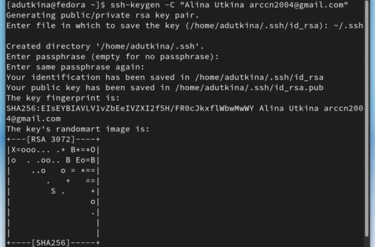
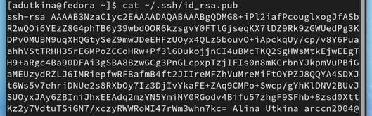
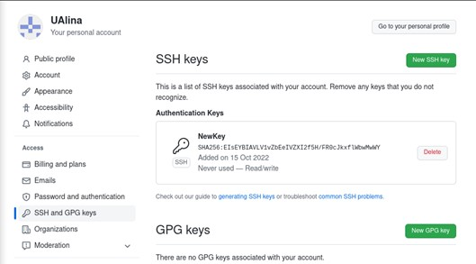

---
## Front matter
title: "Отчёт по лабораторной работе №3"
subtitle: "Простейший вариант"
author: "Уткина Алина Дмитриевна"

## Generic otions
lang: ru-RU
toc-title: "Содержание"

## Bibliography
bibliography: bib/cite.bib
csl: pandoc/csl/gost-r-7-0-5-2008-numeric.csl

## Pdf output format
toc: true # Table of contents
toc-depth: 2
lof: true # List of figures
lot: true # List of tables
fontsize: 12pt
linestretch: 1.5
papersize: a4
documentclass: scrreprt
## I18n polyglossia
polyglossia-lang:
  name: russian
  options:
	- spelling=modern
	- babelshorthands=true
polyglossia-otherlangs:
  name: english
## I18n babel
babel-lang: russian
babel-otherlangs: english
## Fonts
mainfont: PT Serif
romanfont: PT Serif
sansfont: PT Sans
monofont: PT Mono
mainfontoptions: Ligatures=TeX
romanfontoptions: Ligatures=TeX
sansfontoptions: Ligatures=TeX,Scale=MatchLowercase
monofontoptions: Scale=MatchLowercase,Scale=0.9
## Biblatex
biblatex: true
biblio-style: "gost-numeric"
biblatexoptions:
  - parentracker=true
  - backend=biber
  - hyperref=auto
  - language=auto
  - autolang=other*
  - citestyle=gost-numeric
## Pandoc-crossref LaTeX customization
figureTitle: "Рис."
tableTitle: "Таблица"
listingTitle: "Листинг"
lofTitle: "Список иллюстраций"
lotTitle: "Список таблиц"
lolTitle: "Листинги"
## Misc options
indent: true
header-includes:
  - \usepackage{indentfirst}
  - \usepackage{float} # keep figures where there are in the text
  - \floatplacement{figure}{H} # keep figures where there are in the text
---

# Цель работы

Целью данной работы является изучение идеологии и применения средств контроля версий, приобретение практических навыков по работе с системой git.

# Выполнение лабораторной работы

## Базовая настройка git

Заходим в уже созданную учетную запись на сайте https://github.com.
Сначала сделаем предварительную конфигурацию git. Откроем терминал и введем следующие команды, указав имя и email 
(рис. [-@fig:001])

{ #fig:001 width=70% }

Настроим utf-8 в выводе сообщений git (рис. [-@fig:002])

{ #fig:002 width=70% }

Зададим имя начальной ветки – master и установим параметры autocrlf и safecrlf (рис. [-@fig:003])

{ #fig:003 width=70% }

## Создание SSH ключа

Для последующей идентификации пользователя на сервере репозиториев необходимо сгенерировать пару ключей (приватный и открытый). Ключи сохраняться в каталоге ~/.ssh/ (рис. [-@fig:004])

{ #fig:004 width=70% }

Далее загружаем сгенерированный открытый ключ. Для этого нужно зайти на сайт http://github.org/ под своей учётной записью и перейти в меню Setting. После этого выбрать в боковом меню SSH and GPG keys и нажать кнопку New SSH key. Скопировав из локальной консоли ключ в буфер обмена, вставляем ключ в появившееся на сайте поле и указываем для ключа имя (рис. [-@fig:005])(рис. [-@fig:006])

{ #fig:005 width=70% }

{ #fig:006 width=70% }

# Выводы

В ходе лабораторной работы были изучены идеологии и применение средств контроля версий, приобретены практические навыки по работе с системой git.

