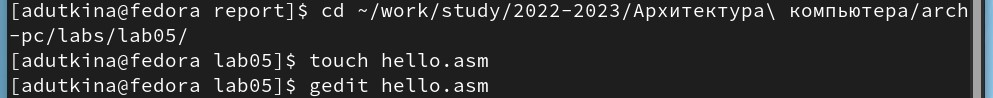
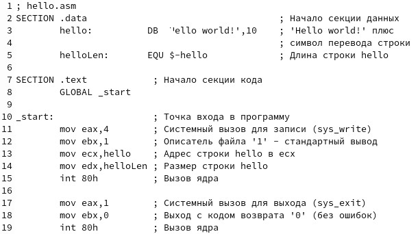
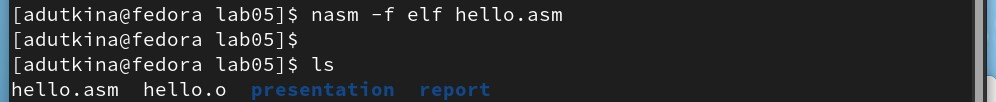
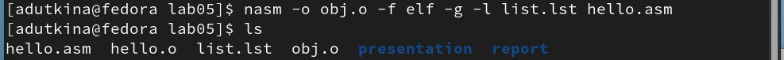
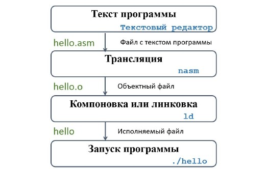
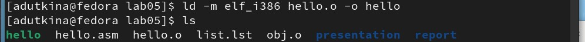
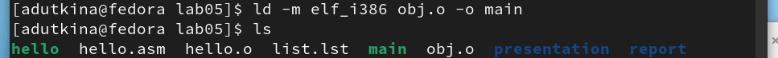
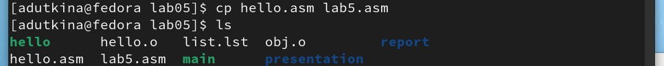
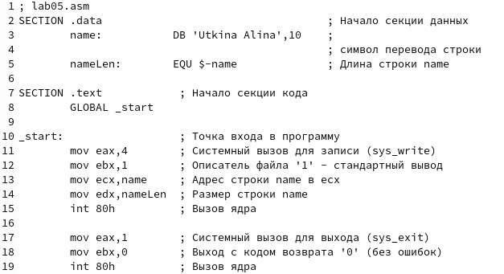
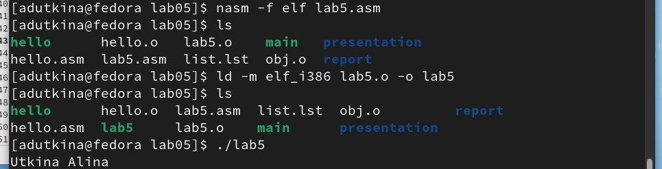

---
## Front matter
title: "Отчёт по лабораторной работе №5"
author: "Уткина Алина Дмитриевна"

## Generic otions
lang: ru-RU
toc-title: "Содержание"

## Bibliography
bibliography: bib/cite.bib
csl: pandoc/csl/gost-r-7-0-5-2008-numeric.csl

## Pdf output format
toc: true # Table of contents
toc-depth: 2
lof: true # List of figures
lot: true # List of tables
fontsize: 12pt
linestretch: 1.5
papersize: a4
documentclass: scrreprt
## I18n polyglossia
polyglossia-lang:
  name: russian
  options:
	- spelling=modern
	- babelshorthands=true
polyglossia-otherlangs:
  name: english
## I18n babel
babel-lang: russian
babel-otherlangs: english
## Fonts
mainfont: PT Serif
romanfont: PT Serif
sansfont: PT Sans
monofont: PT Mono
mainfontoptions: Ligatures=TeX
romanfontoptions: Ligatures=TeX
sansfontoptions: Ligatures=TeX,Scale=MatchLowercase
monofontoptions: Scale=MatchLowercase,Scale=0.9
## Biblatex
biblatex: true
biblio-style: "gost-numeric"
biblatexoptions:
  - parentracker=true
  - backend=biber
  - hyperref=auto
  - language=auto
  - autolang=other*
  - citestyle=gost-numeric
## Pandoc-crossref LaTeX customization
figureTitle: "Рис."
tableTitle: "Таблица"
listingTitle: "Листинг"
lofTitle: "Список иллюстраций"
lotTitle: "Список таблиц"
lolTitle: "Листинги"
## Misc options
indent: true
header-includes:
  - \usepackage{indentfirst}
  - \usepackage{float} # keep figures where there are in the text
  - \floatplacement{figure}{H} # keep figures where there are in the text
---

# Цель работы

Целью данной работы является освоение процедуры компиляции и сборки программ, написанных на ассем-
блере NASM.

# Выполнение лабораторной работы

## Программа Hello world!

Рассмотрим пример простой программы на языке ассемблера NASM. Традиционно первая программа выводит приветственное сообщение Hello world! на экран.

Для этого переходим в каталог для работы с программами на языке ассемблера NASM, cоздаем там текстовый файл с именем hello.asm и открывам его с помощью текстового редактора gedit (рис. [-@fig:001]).
{ #fig:001 width=70% }

Далее в файл вводим следующий текст (рис. [-@fig:002]):
{ #fig:002 width=70% }

В отличие от многих современных высокоуровневых языков программирования, в ассемблерной программе каждая команда располагается на отдельной строке. Размещение нескольких команд на одной строке недопустимо. Синтаксис ассемблера NASM является чувствительным к регистру, т.е. есть разница между большими и малыми буквами.

## Транслятор NASM

NASM превращает текст программы в объектный код. Например, для компиляции приведённого выше текста программы «Hello World» необходимо написать определенную команду (рис. [-@fig:003]):
{ #fig:003 width=70% }

Если текст программы набран без ошибок, то транслятор преобразует текст программы из файла hello.asm в объектный код, который запишется в файл hello.o. Таким образом, имена всех файлов получаются из имени входного файла и расширения по умолчанию. При наличии ошибок объектный файл не создаётся, а после запуска транслятора появятся сообщения об ошибках или предупреждения. 
NASM не запускают без параметров. Ключ -f указывает транслятору, что требуется создать бинарные файлы в формате ELF. Следует отметить, что формат elf64 позволяет создавать исполняемый код, работающий под 64-битными версиями Linux. Для 32-битных версий ОС указываем в качестве формата просто elf.
NASM всегда создаёт выходные файлы в текущем каталоге.

## Расширенный синтаксис командной строки NASM

Полный вариант командной строки nasm выглядит следующим образом: 
nasm [-@ косвенный_файл_настроек] [-o объектный_файл] [-f формат_объектного_файла] [-l листинг] [параметры...] [--] исходный_файл

Выполним следующую команду (рис. [-@fig:004]):
{ #fig:004 width=70% }

Данная команда скомпилирует исходный файл hello.asm в obj.o (опция -o позволяет задать имя объектного файла, в данном случае obj.o), при этом формат выходного файла будет elf, и в него будут включены символы для отладки (опция -g), кроме того, будет создан файл листинга list.lst (опция -l).

## Компоновщик LD

Как видно из схемы (рис. [-@fig:005]), чтобы получить исполняемую программу,
объектный файл необходимо передать на обработку компоновщику (рис. [-@fig:006]):
{ #fig:005 width=70% }
{ #fig:006 width=70% }

Компоновщик ld не предполагает по умолчанию расширений для файлов, но
принято использовать следующие расширения:
* o – для объектных файлов;
* без расширения – для исполняемых файлов;
* map – для файлов схемы программы;
* lib – для библиотек

Ключ -o с последующим значением задаёт в данном случае имя создаваемого исполняемого файла.
Выполним следующую команду (рис. [-@fig:007])
{ #fig:007 width=70% }

Здесь исполняемый файл с именем main, а объектный файл, из котоорого собран исполняемый файл - obj.o

## Запуск исполняемого файла

Запустить на выполнение созданный исполняемый файл, находящийся в текущем каталоге, можно, набрав в командной строке ./hello (рис. [-@fig:008])
{ #fig:008 width=70% }

## Задания для самостоятельной работы

1. В каталоге ~/.../lab05 с помощью команды cp создадим копию файла hello.asm с именем lab5.asm (рис. [-@fig:009])
{ #fig:009 width=70% }

2. С помощью любого текстового редактора внесем изменения в текст программы в файле lab5.asm так, чтобы вместо Hello world! на экран выводилась строка с фамилией и именем (рис. [-@fig:010]).
{ #fig:010 width=70% }

3. Оттранслируем полученный текст программы lab5.asm в объектный файл. Выполним компоновку объектного файла и запустим получившийся исполняемый файл (рис. [-@fig:011]).
{ #fig:011 width=70% }

4. Скопируем файлы hello.asm и lab5.asm в локальный репозиторий в каталог ~/work/study/2022-2023/"Архитектура компьютера"/archpc/labs/lab05/. Загрузим файлы на Github.

(рис. [-@fig:00])

{ #fig:00 width=70% }

# Выводы

В ходе лабораторной работы были изучены теоретические сведения о языке ассемблера и освоены процедуры компиляции и сборки программ, написанных на ассемблере NASM.
