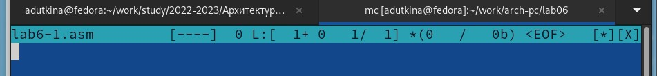
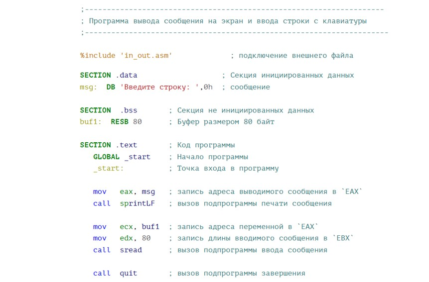

---
## Front matter
title: "Отчёт по лабораторной работе №6"
author: "Уткина Алина Дмитриевна"

## Generic otions
lang: ru-RU
toc-title: "Содержание"

## Bibliography
bibliography: bib/cite.bib
csl: pandoc/csl/gost-r-7-0-5-2008-numeric.csl

## Pdf output format
toc: true # Table of contents
toc-depth: 2
lof: true # List of figures
lot: true # List of tables
fontsize: 12pt
linestretch: 1.5
papersize: a4
documentclass: scrreprt
## I18n polyglossia
polyglossia-lang:
  name: russian
  options:
	- spelling=modern
	- babelshorthands=true
polyglossia-otherlangs:
  name: english
## I18n babel
babel-lang: russian
babel-otherlangs: english
## Fonts
mainfont: PT Serif
romanfont: PT Serif
sansfont: PT Sans
monofont: PT Mono
mainfontoptions: Ligatures=TeX
romanfontoptions: Ligatures=TeX
sansfontoptions: Ligatures=TeX,Scale=MatchLowercase
monofontoptions: Scale=MatchLowercase,Scale=0.9
## Biblatex
biblatex: true
biblio-style: "gost-numeric"
biblatexoptions:
  - parentracker=true
  - backend=biber
  - hyperref=auto
  - language=auto
  - autolang=other*
  - citestyle=gost-numeric
## Pandoc-crossref LaTeX customization
figureTitle: "Рис."
tableTitle: "Таблица"
listingTitle: "Листинг"
lofTitle: "Список иллюстраций"
lotTitle: "Список таблиц"
lolTitle: "Листинги"
## Misc options
indent: true
header-includes:
  - \usepackage{indentfirst}
  - \usepackage{float} # keep figures where there are in the text
  - \floatplacement{figure}{H} # keep figures where there are in the text
---

# Цель работы

Целью данной работы является приобретение практических навыков работы в Midnight Commander. Освоение инструкций языка ассемблера mov и int.

# Выполнение лабораторной работы

С помощью команды mc откроем Midnight Commander, пользуясь клавишами ↑ , ↓ и Enter перейдем в каталог ~/work/arch-pc, созданный при выполнении лабораторной работы №5 (рис. [-@fig:001]). 

{ #fig:001 width=70% }

С помощью функциональной клавиши F7 создадим папку lab06 (рис. [-@fig:002]) и перейдем в созданный каталог. 

{ #fig:002 width=70% }

Пользуясь строкой ввода и командой touch создадим файл lab6-1.asm (рис. [-@fig:003]).

{ #fig:003 width=70% }

С помощью функциональной клавиши F4 откроем файл lab6-1.asm для редактирования во встроенном редакторе mcedit (рис. [-@fig:004]). 

{ #fig:004 width=70% }

Введем текст программы из листинга 1 (рис. [-@fig:005]), сохраним изменения и закроем файл (рис. [-@fig:006]). 

{ #fig:005 width=70% }

{ #fig:006 width=70% }

С помощью функциональной клавиши F3 откроем файл lab6-1.asm для просмотра. Убедимся, что файл содержит текст программы.

Оттранслируем текст программы lab6-1.asm в объектный файл. Выполним компоновку объектного файла и запустим получившийся исполняемый файл. Программа выводит строку 'Введите строку:' и ожидает ввода с клавиатуры. Введем ФИО. (рис. [-@fig:007])

{ #fig:007 width=70% }

## Подключение внешнего файла in_out.asm

Скачаем файл in_out.asm со страницы курса в ТУИС. Подклчаемый файл должен лежать в том же каталоге, что и файл с программой, в которой он используется. 

В одной из панелей mc откроем каталог с файлом lab6-1.asm. В другой панели каталог со скаченным файлом in-out.asm. Скопируем файл in_out.asm в каталог с файлом lab6-1.asm с помощью функциональной клавиши F5 (рис. [-@fig:008])

{ #fig:008 width=70% }

С помощью функциональной клавиши F6 создадим копию файла lab6-1.asm с именем lab6-2.asm (рис. [-@fig:009])

{ #fig:009 width=70% }

Исправим текст программы в файле lab6-2.asm с использованием подпрограмм из внешнего файла in_out.asm в соответствии с листингом 2 (рис. [-@fig:010]). Создадим исполняемый файл и проверим его работу.

{ #fig:010 width=70% }

В файле lab6-2.asm заменим подпрограмму sprintLF на sprint. При запуске программ разница в том, что в первом случае мы вводим данные в новую сторку, а во втором - в ту же, где выводится сообщение "Введите строку: "

## Самостоятельная работа

Создадим копию файла lab6-1.asm. Внесем изменения в программу (без использования внешнего файла in_out.asm), так чтобы она работала по следующему алгоритму:
	- вывести приглашение типа “Введите строку:”;
 	- ввести строку с клавиатуры;
	- вывести введённую строку на экран.

Для этого вставим блок команд:
	- mov eax,4 ; Системный вызов для записи (sys_write)
	- mov ebx,1 ; Описатель файла 1 - стандартный вывод
	- mov ecx, buf1 ; Адрес строки 'buf1' в 'ecx'
	- int 80h ; Вызов ядра

(рис. [-@fig:012])

{ #fig:012 width=70% }

Создадим копию файла lab6-2.asm. Исправим текст программы с использование подпрограмм из внешнего файла in_out.asm, так чтобы она работала по следующему алгоритму:
	- вывести приглашение типа “Введите строку:”;
	- ввести строку с клавиатуры;
	- вывести введённую строку на экран.

Для этого можно использовать те же команды (рис. [-@fig:013])

{ #fig:013 width=70% }

# Выводы

В ходе лабораторной работы были изучены основы работы с Midnight Commander, структура программы на языке ассемблера NASM, элементы программирования. Также были приобретены практические навыки работы в Midnight Commander и освоены инструкций языка ассемблера mov и int.

