---
## Front matter
title: "Отчёт по лабораторной работе №7"
author: "Уткина Алина Дмитриевна"

## Generic otions
lang: ru-RU
toc-title: "Содержание"

## Bibliography
bibliography: bib/cite.bib
csl: pandoc/csl/gost-r-7-0-5-2008-numeric.csl

## Pdf output format
toc: true # Table of contents
toc-depth: 2
lof: true # List of figures
lot: true # List of tables
fontsize: 12pt
linestretch: 1.5
papersize: a4
documentclass: scrreprt
## I18n polyglossia
polyglossia-lang:
  name: russian
  options:
	- spelling=modern
	- babelshorthands=true
polyglossia-otherlangs:
  name: english
## I18n babel
babel-lang: russian
babel-otherlangs: english
## Fonts
mainfont: PT Serif
romanfont: PT Serif
sansfont: PT Sans
monofont: PT Mono
mainfontoptions: Ligatures=TeX
romanfontoptions: Ligatures=TeX
sansfontoptions: Ligatures=TeX,Scale=MatchLowercase
monofontoptions: Scale=MatchLowercase,Scale=0.9
## Biblatex
biblatex: true
biblio-style: "gost-numeric"
biblatexoptions:
  - parentracker=true
  - backend=biber
  - hyperref=auto
  - language=auto
  - autolang=other*
  - citestyle=gost-numeric
## Pandoc-crossref LaTeX customization
figureTitle: "Рис."
tableTitle: "Таблица"
listingTitle: "Листинг"
lofTitle: "Список иллюстраций"
lotTitle: "Список таблиц"
lolTitle: "Листинги"
## Misc options
indent: true
header-includes:
  - \usepackage{indentfirst}
  - \usepackage{float} # keep figures where there are in the text
  - \floatplacement{figure}{H} # keep figures where there are in the text
---

# Цель работы

Целью работы является освоение арифметических инструкций языка ассемблера NASM.

# Выполнение лабораторной работы

## Символьные строки и численные данные в NASM

Создадим каталог для программ лабораторной работы №7, перейдем в него и создадим файл lab7-1.asm. (рис. [-@fig:001])

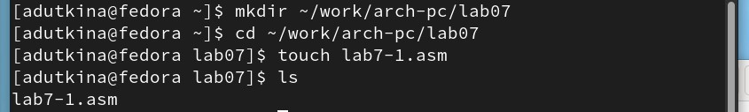{ #fig:001 width=70% }

Рассмотрим примеры программ вывода символьных и численных значений. Программы будут выводить значения записанные в регистр eax.

Введем в файл lab7-1.asm текст программы из листинга 7.1 (рис. [-@fig:002]). В данной программе в регистр eax записывается символ 6 (mov eax,'6'), в регистр ebx символ 4 (mov ebx,'4'). Далее к значению в регистре eax прибавляем значение регистра ebx (add eax,ebx, результат сложения запишется в регистр eax). Далее выводим результат. Так как для работы функции sprintLF в регистр eax должен быть записан адрес, необходимо использовать дополнительную переменную. Для этого запишем значение регистра eax в переменную buf1 (mov [buf1],eax), а затем запишем адрес переменной buf1 в регистр eax (mov eax,buf1) и вызовем функцию sprintLF. 

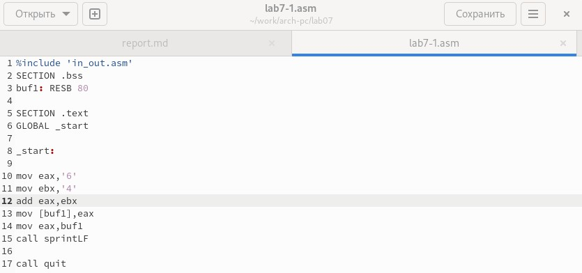{ #fig:002 width=70% }

Создадим исполняемый файл и запустим его (рис. [-@fig:003]).

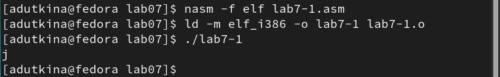{ #fig:003 width=70% }

В данном случае при выводе значения регистра eax мы ожидаем увидеть число 10. Однако результатом будет символ j. Это происходит потому, что код символа 6 равен 00110110 в двоичном представлении (или 54 в десятичном представлении), а код символа 4 – 00110100 (52). Команда add eax,ebx запишет в регистр eax сумму кодов – 01101010 (106), что в свою очередь является кодом символа j.

Далее изменим текст программы и вместо символов, запишем в регистры числа. Исправим текст программы следующим образом (рис. [-@fig:004]):

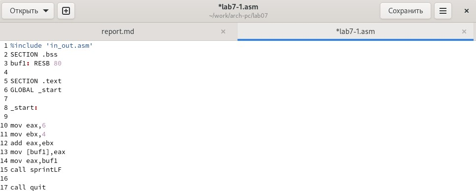{ #fig:004 width=70% }

Как и в предыдущем случае мы не получаем число 10. В данном случае выводится символ с кодом 10. По таблице ASCII можно определить, что код 10 соответствует символу "\n". При запуске программы видно, что на экран выводится только пустая строка (рис. [-@fig:005]).

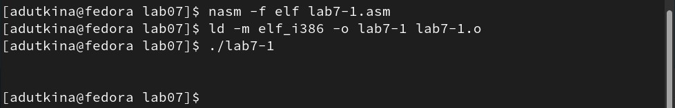{ #fig:005 width=70% }

Для работы с числами в файле in_out.asm реализованы подпрограммы для преобразования ASCII символов в числа и обратно. Преобразуем текст программы из Листинга 7.1 с использованием этих функций. Создадим файл lab7-2.asm и введем в него текст программы из листинга 7.2 (рис. [-@fig:006]).

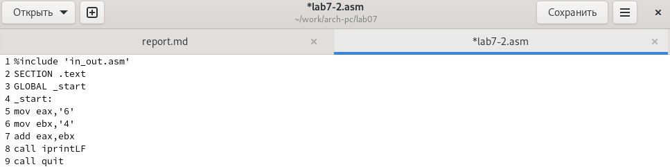{ #fig:006 width=70% }

В результате работы программы мы получили число 106. В данном случае, как и в первом, команда add складывает коды символов ‘6’ и ‘4’ (54+52=106). Однако, в отличии от программы из листинга 7.1, функция iprintLF позволяет вывести число, а не символ, кодом которого является это число (рис. [-@fig:007])

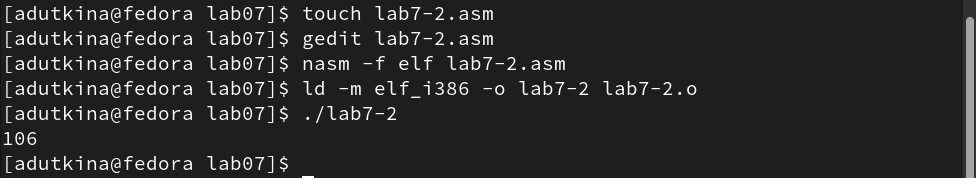{ #fig:007 width=70% }

Аналогично предыдущему примеру изменим символы на числа. При исполнении программы мы получим 10 (рис. [-@fig:008]).

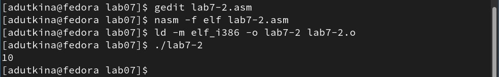{ #fig:008 width=70% }

Заменим функцию iprintLF на iprint. Создадим исполняемый файл и запустим его. Чем отличается вывод функций iprintLF и iprint? В этом случае после вывода результата нет отступа сроки (рис. [-@fig:009])

{ #fig:009 width=70% }

## Выполнение арифметических операций в NASM

В качестве примера выполнения арифметических операций в NASM приведем программу вычисления арифметического выражения 𝑓(𝑥) = (5 ∗ 2 + 3)/3.

Создадим файл lab7-3.asm и введем в него текст из листинга 7.3 (рис. [-@fig:010]).

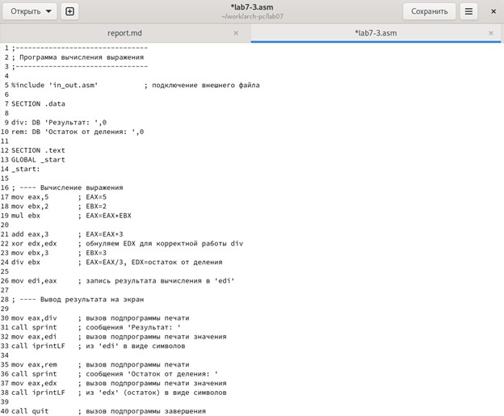{ #fig:010 width=70% }

При запуске программы выводятся результат и остаток от деления (рис. [-@fig:011]).

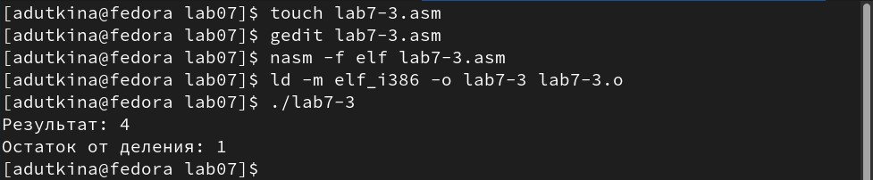{ #fig:011 width=70% }

Изменим текст программы для вычисления выражения 𝑓(𝑥) = (4 ∗ 6 + 2)/5 (рис. [-@fig:012]). Запускаем исполняемый файл (рис. [-@fig:013]).

{ #fig:012 width=70% }

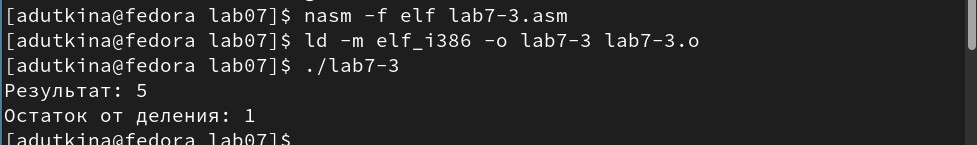{ #fig:013 width=70% }

В качестве другого примера рассмотрим программу вычисления варианта задания по номеру студенческого билета, работающую по следующему алгоритму:
	- вывести запрос на введение № студенческого билета
	- вычислить номер варианта по формуле: (𝑆𝑛 mod 20) + 1, где 𝑆𝑛 – номер студенческого билета (В данном случае 𝑎 mod 𝑏 – это остаток от деления 𝑎 на 𝑏).
	- вывести на экран номер варианта.

В данном случае число, над которым необходимо проводить арифметические операции, вводится с клавиатуры. Как отмечалось выше ввод с клавиатуры осуществляется в символьном виде и для корректной работы арифметических операций в NASM символы необходимо преобразовать в числа. Для этого может быть использована функция atoi из файла in_out.asm.

Создадим файл variant.asm и введем в него текст из листинга 7.4 (рис. [-@fig:014]).

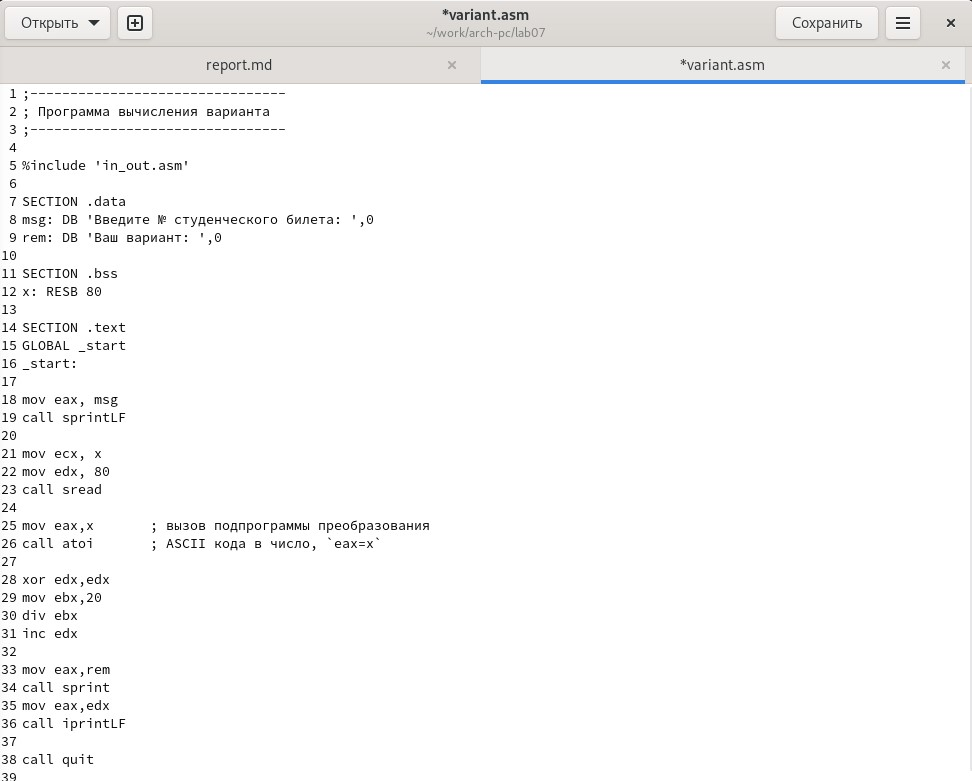{ #fig:014 width=70% }

Создадим исполняемый файл и запустим его (рис. [-@fig:015]). Вычислив номер варианта аналитически мы получаем, что 1132226534 % 20 = 14, 14 + 1 = 15. Значит, программа работает правильно.

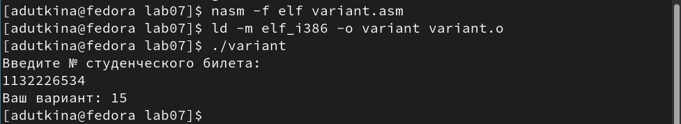{ #fig:015 width=70% }

Таким образом:
1. За вывод на экран сообщения "Ваш вариант" отвечают строки 33-34 kbcnbyuf 7.4; 
2. Конструкция mov eсx,x отвечает за запись значения х в регистр ecx; mov edx, 80 определяет длину вводимой строки; call sread вызыват подпрограмму ввода сообщения;
3. Call atoi используется для преобразования ASCII кода в число;
4. За вычисление варианта отвечают строки 28-31 листинга 7.4;
5. Остаток от деления при выполнении инструкции “div ebx” запишется в регистр "edx";
6. Инструкция “inc edx” используется для уменьшения значения в регистре "edx";
7. За вывод на экран результата вычислений отвечают строки 35-36.

## Самостоятельная работа

Напишем программу для работы с функцией f(x)=(5+x)^2 - 3 в файл variant2.asm. Проверим работу программы для значений х1=5, х2=1 (рис. [-@fig:016]).

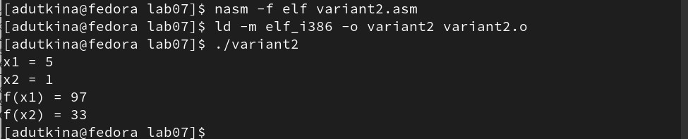{ #fig:016 width=70% }

# Выводы

В ходе лабораторной работы были изучены арифметические инструкции языка ассемблера NASM.

 
