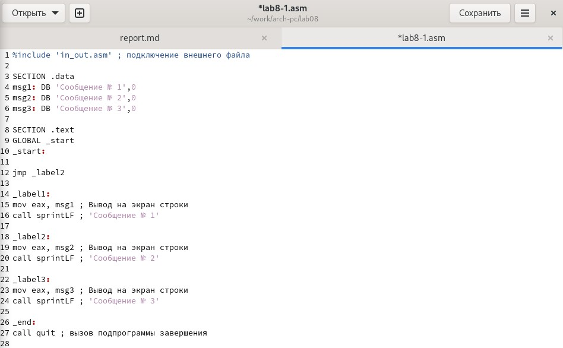
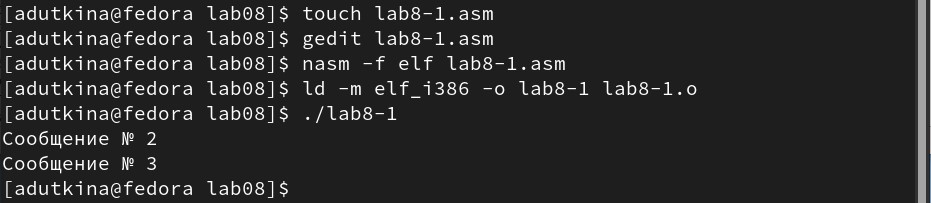
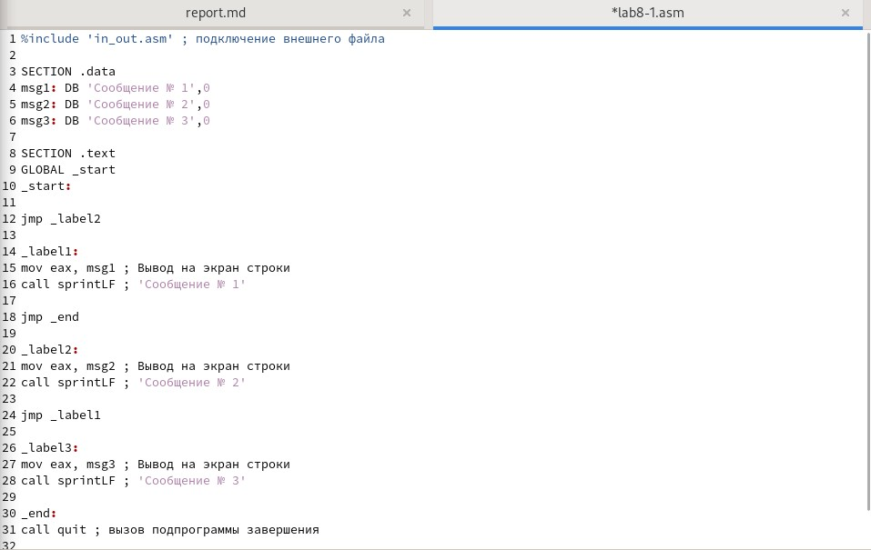
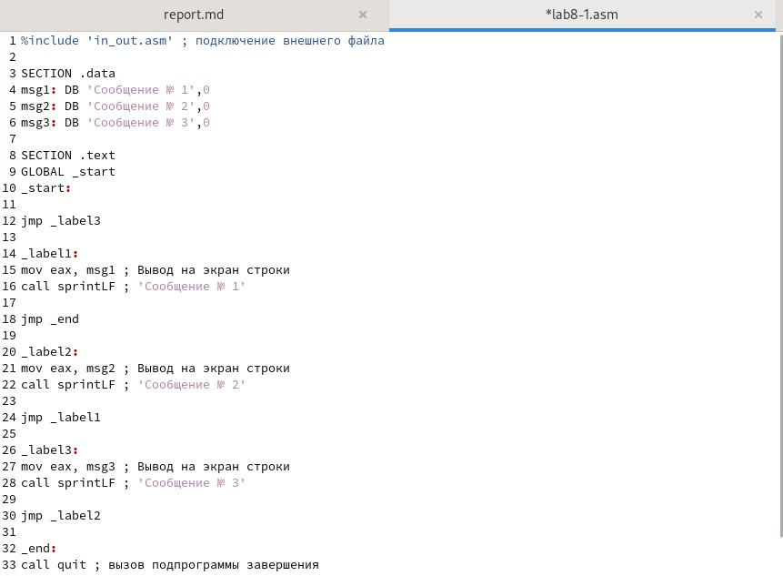
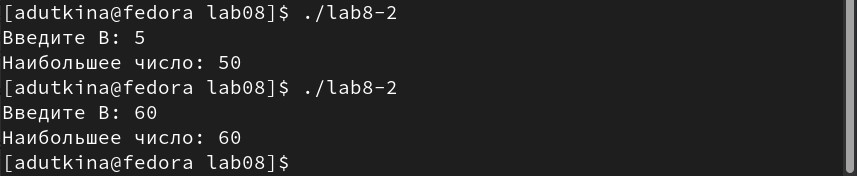
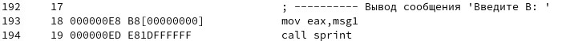
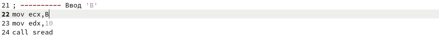
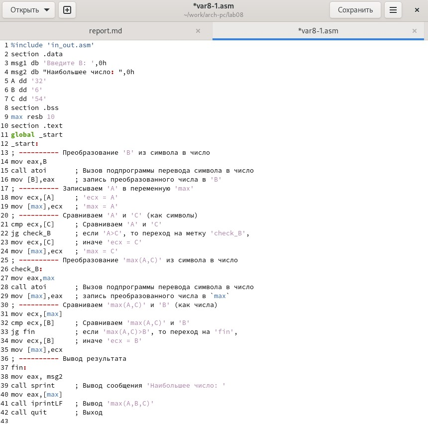
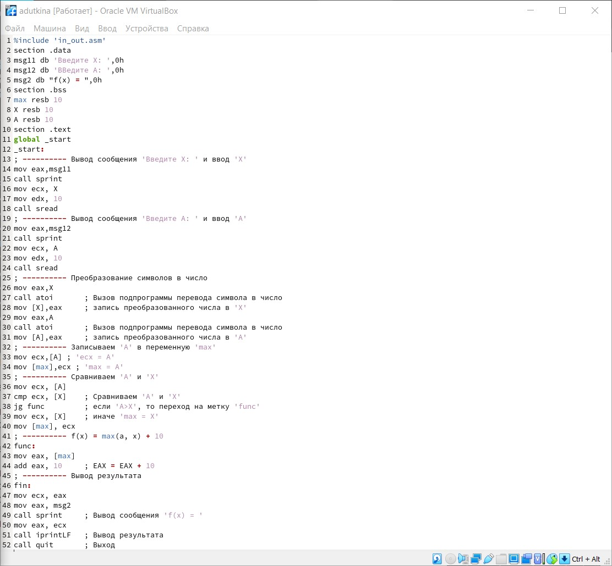
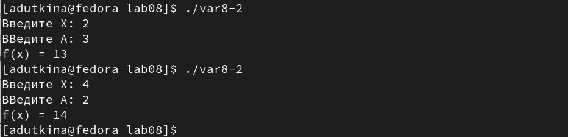

---
## Front matter
title: "Отчёт по лабораторной работе №8"
author: "Уткина Алина Дмитриевна"

## Generic otions
lang: ru-RU
toc-title: "Содержание"

## Bibliography
bibliography: bib/cite.bib
csl: pandoc/csl/gost-r-7-0-5-2008-numeric.csl

## Pdf output format
toc: true # Table of contents
toc-depth: 2
lof: true # List of figures
lot: true # List of tables
fontsize: 12pt
linestretch: 1.5
papersize: a4
documentclass: scrreprt
## I18n polyglossia
polyglossia-lang:
  name: russian
  options:
	- spelling=modern
	- babelshorthands=true
polyglossia-otherlangs:
  name: english
## I18n babel
babel-lang: russian
babel-otherlangs: english
## Fonts
mainfont: PT Serif
romanfont: PT Serif
sansfont: PT Sans
monofont: PT Mono
mainfontoptions: Ligatures=TeX
romanfontoptions: Ligatures=TeX
sansfontoptions: Ligatures=TeX,Scale=MatchLowercase
monofontoptions: Scale=MatchLowercase,Scale=0.9
## Biblatex
biblatex: true
biblio-style: "gost-numeric"
biblatexoptions:
  - parentracker=true
  - backend=biber
  - hyperref=auto
  - language=auto
  - autolang=other*
  - citestyle=gost-numeric
## Pandoc-crossref LaTeX customization
figureTitle: "Рис."
tableTitle: "Таблица"
listingTitle: "Листинг"
lofTitle: "Список иллюстраций"
lotTitle: "Список таблиц"
lolTitle: "Листинги"
## Misc options
indent: true
header-includes:
  - \usepackage{indentfirst}
  - \usepackage{float} # keep figures where there are in the text
  - \floatplacement{figure}{H} # keep figures where there are in the text
---

# Цель работы

Цель данной работы является изучение команд условного и безусловного переходов, приобретение навыков написания программ с использованием переходов, знакомство с назначением и структурой файла листинга.

# Выполнение лабораторной работы

## Реализация переходов в NASM

Создадим каталог для программам лабораторной работы № 8, перейдем в него и создадим файл lab8-1.asm. Инструкция jmp в NASM используется для реализации безусловных переходов. Рассмотрим пример программы с использованием инструкции jmp. Введем в файл lab8-1.asm текст программы из листинга 8.1 (рис. [-@fig:001]).

{ #fig:001 width=70% }

Создадим исполняемый файл и запустим его. В результате работы данной программы будут выведены строки "Сооющение №2" и "Сообщение №3" (рис. [-@fig:002]).

{ #fig:002 width=70% }

Таким образом, использование инструкции jmp _label2 меняет порядок исполнения инструкций и позволяет выполнить инструкции начиная с метки _label2, пропустив вывод первого сообщения.

Инструкция jmp позволяет осуществлять переходы не только вперед но и назад. Изменим программу таким образом, чтобы она выводила сначала ‘Сообщение № 2’, потом ‘Сообщение № 1’ и завершала работу. Для этого в текст программы после вывода сообщения № 2 добавим инструкцию jmp с меткой _label1 (т.е. переход к инструкциям вывода сообщения № 1) и после вывода сообщения № 1 добавим инструкцию jmp с меткой _end (т.е. переход к инструкции call quit). Изменим текст программы в соответствии с листингом 8.2 (рис. [-@fig:003]). При запуске программы выводится именно то, что нам нужно (рис. [-@fig:004]).

{ #fig:003 width=70% }

{ #fig:004 width=70% }

Изменим текст программы добавив или изменив инструкции jmp, чтобы программа выводила сообщения в обратном порядке (рис. [-@fig:005]). Запустим исполняемый файл, чтобы проверить его работу (рис. [-@fig:006]).

{ #fig:005 width=70% }

{ #fig:006 width=70% }

Использование инструкции jmp приводит к переходу в любом случае. Однако, часто при написании программ необходимо использовать условные переходы, т.е. переход должен происходить если выполнено какое-либо условие. В качестве примера рассмотрим программу, которая определяет и выводит на экран наибольшую из 3 целочисленных переменных: A,B и C. Значения для A и C задаются в программе, значение B вводиться с клавиатуры.
Создадим файл lab8-2.asm в каталоге ~/work/arch-pc/lab08. Внимательно изучим текст программы из листинга 8.3 и введем его в lab8-2.asm (рис. [-@fig:007]). Создадим исполнительный файл и запустим его (рис. [-@fig:008])

{ #fig:007 width=70% }

{ #fig:008 width=70% }

Следует заметить, что в данном примере переменные A и С сравниваются как символы, а переменная B и максимум из A и С как числа (для этого используется функция atoi преобразования символа в число). Это сделано для демонстрации того, как сравниваются данные. Данную программу можно упростить и сравнивать все 3 переменные как символы (т.е. не использовать функцию atoi). Однако если переменные преобразовать из символов в числа, над ними можно корректно проводить арифметические операции.

## Изучение структуры файлов листинга

Обычно nasm создаёт в результате ассемблирования только объектный файл. Получить файл листинга можно, указав ключ -l и задав имя файла листинга в командной строке. 
Создадим файл листинга для программы из файла lab8-2.asm (рис. [-@fig:009]).

{ #fig:009 width=70% }

Откроем файл листинга lab8-2.lst с помощью текстового редактора, ознакомиться с его форматом и содержимым. Рассмотрим содержимое трёх строк (192-194) файла листинга (рис. [-@fig:010]). 

{ #fig:010 width=70% }

Можно замеить, что номера строки файла листиинга не совпадают с номерами строк исходного текста программ. Это связано с тем, что перед самой программой в листинге присутствует информация о функциях, используемых из подключаемого файла. В первой из трех рассматриваемых строк нет адреса и машинного кода, так как исходный текст программы - это только комментарий, а значит и машинный код не генерируется. В следующих двух строчках исходного кода содуржатся команды, поэтому у них есть и адрес - смещение машинного кода от начала сегмента, и машинный код - ассемблированная исходная строка, инструкция на машинном языке, вызывающая прерывние ядра: 000000EB и B8[00000000] - адрес и код соответсвенно для команды mov,  000000ED и E81DFFFFFF - для команды call sprint. 

Откроем файл с программой lab8-2.asm и в инструкции mov (строка 22) с двумя операндами (ecx, B) удалим второй операнд (рис. [-@fig:011]). Выполним трансляцию с получением файла листинга (рис. [-@fig:012]). В результате работы выдается ошибка с указанием на номер неправильной строки (22). Создается файл lab8-2.lst, в котором добавляется дополнительная строка (с тем же номером) отмеченная звездочками с указанием проблемы (рис. [-@fig:013]).

{ #fig:011 width=70% }

{ #fig:012 width=70% }

{ #fig:013 width=70% }

## Самостоятельная работа

Напишем программу нахождения наименьшей из 3 целочисленных переменных a, b и c, где значения переменных равны 32, 6 и 54 соответственно (рис. [-@fig:014]). Создадим исполняемый файл и проверим его работу (рис. [-@fig:015]).

{ #fig:014 width=70% }

{ #fig:015 width=70% }

Напишем программу, которая для введенных с клавиатуры значений x и a вычисляет значение заданной функции №15 (рис. [-@fig:016]) и выводит результат вычислений (рис. [-@fig:017]). Создадим исполняемый файл и проверим его работу для значений x и a равныч 2, 3 соответственно для первого теста и 4, 2 - для второго (рис. [-@fig:018]).

{ #fig:016 width=70% }

{ #fig:017 width=70% }

{ #fig:018 width=70% }

# Выводы

В ходе данной работы были изучены команды условного, безусловного переходов и назначение, структура файла листинга, приобретены навыки написания программ с использованием переходов.
