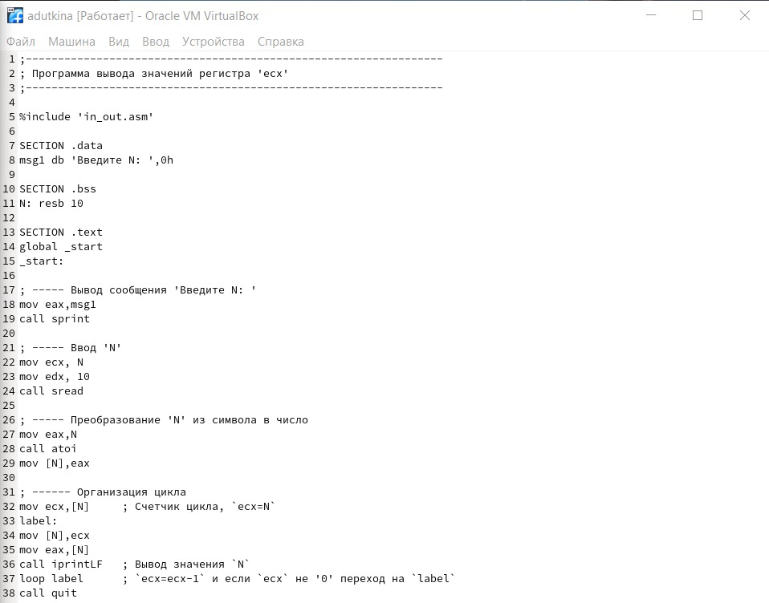

---
## Front matter
title: "Отчёта по лабораторной работе №9"
author: "Уткина Алина Дмитриевна"

## Generic otions
lang: ru-RU
toc-title: "Содержание"

## Bibliography
bibliography: bib/cite.bib
csl: pandoc/csl/gost-r-7-0-5-2008-numeric.csl

## Pdf output format
toc: true # Table of contents
toc-depth: 2
lof: true # List of figures
fontsize: 12pt
linestretch: 1.5
papersize: a4
documentclass: scrreprt
## I18n polyglossia
polyglossia-lang:
  name: russian
  options:
	- spelling=modern
	- babelshorthands=true
polyglossia-otherlangs:
  name: english
## I18n babel
babel-lang: russian
babel-otherlangs: english
## Fonts
mainfont: PT Serif
romanfont: PT Serif
sansfont: PT Sans
monofont: PT Mono
mainfontoptions: Ligatures=TeX
romanfontoptions: Ligatures=TeX
sansfontoptions: Ligatures=TeX,Scale=MatchLowercase
monofontoptions: Scale=MatchLowercase,Scale=0.9
## Biblatex
biblatex: true
biblio-style: "gost-numeric"
biblatexoptions:
  - parentracker=true
  - backend=biber
  - hyperref=auto
  - language=auto
  - autolang=other*
  - citestyle=gost-numeric
## Pandoc-crossref LaTeX customization
figureTitle: "Рис."
tableTitle: "Таблица"
listingTitle: "Листинг"
lofTitle: "Список иллюстраций"
lotTitle: "Список таблиц"
lolTitle: "Листинги"
## Misc options
indent: true
header-includes:
  - \usepackage{indentfirst}
  - \usepackage{float} # keep figures where there are in the text
  - \floatplacement{figure}{H} # keep figures where there are in the text
---

# Цель работы

Целью данной работы является приобретение навыков написания программ с использованием циклов и
обработкой аргументов командной строки.

# Выполнение лабораторной работы

## Реализация циклов в NASM

Создадим каталог для программам лабораторной работы № 9, перейдем в него и создадим файл lab9-1.asm.

При реализации циклов в NASM с использованием инструкции loop необходимо помнить о том, что эта инструкция использует регистр ecx в качестве счетчика и на каждом шаге уменьшает его значение на единицу. В качестве примера рассмотрим программу, которая выводит значение регистра ecx. Внимательно изучим текст программы из листинга 9.1 и введем его в файл lab9-1.asm (рис. [-@fig:001]). Создадим исполняемый файл и проверим его работу (рис. [-@fig:002]).

{ #fig:001 width=70% }

{ #fig:002 width=70% }

Данный пример показывает, что использование регистра ecx в теле цикла loop может привести к некорректной работе программы. Изменим текст программы, добавив изменение значения регистра ecx в цикле (рис. [-@fig:003]).

{ #fig:003 width=70% }

Создадим исполняемый файл и проверим его работу (рис. [-@fig:004]). Регистр ecx принимает значения на 2 меньше предыдущих. Также, из-за того, что мы ввели нечетное число, 0 не попадает в проверку условия, то есть при одной проверке у нас значение регистра равно 1, а в следующей -1, значит происходит зацикливание. Если мы введем четное число, цикл остановится на 0, сделав в два раза меньше проходов, чем нужно (рис. [-@fig:005]).

{ #fig:004 width=70% }

{ #fig:005 width=70% }

Для использования регистра ecx в цикле и сохранения корректности работы программы можно использовать стек. Внесем изменения в текст программы, добавив команды push и pop (добавления в стек и извлечения из стека) для сохранения значения счетчика цикла loop (рис. [-@fig:006]).

{ #fig:006 width=70% }

Создадим исполняемый файл и проверим его работу (рис. [-@fig:007]). Количество проходов цикла соответствует введенному значению.

{ #fig:007 width=70% }

## Обработка аргументов командной строки

При разработке программ иногда встает необходимость указывать аргументы, которые будут использоваться в программе, непосредственно из командной строки при запуске программы.

При запуске программы в NASM аргументы командной строки загружаются в стек в обратном порядке, кроме того в стек записывается имя программы и общее количество аргументов. Последние два элемента стека для программы, скомпилированной NASM, – это всегда имя программы и количество переданных аргументов.

Таким образом, для того чтобы использовать аргументы в программе, их просто нужно извлечь из стека. Обработку аргументов нужно проводить в цикле. Т.е. сначала нужно извлечь из стека количество аргументов, а затем циклично для каждого аргумента выполнить логику программы. 
В качестве примера рассмотрим программу, которая выводит на экран аргументы командной строки. Внимательно изучим текст программы из листинга 9.2 и введем его в файл lab9-2.asm (рис. [-@fig:008]). Создадим исполняемый файл и запустим его, указав аргументы (рис. [-@fig:009]). Все аргументы были обработаны программой.

{ #fig:008 width=70% }

{ #fig:009 width=70% }

Рассмотрим еще один пример программы которая выводит сумму чисел, которые передаются в программу как аргументы. Создадим файл lab9-3.asm и введем в него текст программы из листинга 9.3 (рис. [-@fig:010]). Создадим исполняемый файл и запустим его, указав аргументы (рис. [-@fig:011]).

{ #fig:010 width=70% }

{ #fig:011 width=70% }

## Самостоятельная работа

Напишем программу, которая находит сумму значений функции f(x) = 6x + 13 для x = x1, x2, ..., xn, т.е. программа должна выводить значение f(x1) + f(x2) +...+ f(xn), где значения xi передаются как аргументы (рис. [-@fig:012]). Создадим исполняемый файл и проверим его работу на нескольких наборах x = x1, x2, ..., xn (рис. [-@fig:013]). Программа работает при различном количестве аргументов верно.

{ #fig:012 width=70% }

{ #fig:013 width=70% }

# Выводы

В ходе данной работы были приобретены навыки написания программ с использованием циклов и
обработкой аргументов командной строки.

