---
## Front matter
title: "Отчёт по лабораторной работе №10"
author: "Уткина Алиина Дмитриевна"

## Generic otions
lang: ru-RU
toc-title: "Содержание"

## Bibliography
bibliography: bib/cite.bib
csl: pandoc/csl/gost-r-7-0-5-2008-numeric.csl

## Pdf output format
toc: true # Table of contents
toc-depth: 2
lof: true # List of figures
fontsize: 12pt
linestretch: 1.5
papersize: a4
documentclass: scrreprt
## I18n polyglossia
polyglossia-lang:
  name: russian
  options:
	- spelling=modern
	- babelshorthands=true
polyglossia-otherlangs:
  name: english
## I18n babel
babel-lang: russian
babel-otherlangs: english
## Fonts
mainfont: PT Serif
romanfont: PT Serif
sansfont: PT Sans
monofont: PT Mono
mainfontoptions: Ligatures=TeX
romanfontoptions: Ligatures=TeX
sansfontoptions: Ligatures=TeX,Scale=MatchLowercase
monofontoptions: Scale=MatchLowercase,Scale=0.9
## Biblatex
biblatex: true
biblio-style: "gost-numeric"
biblatexoptions:
  - parentracker=true
  - backend=biber
  - hyperref=auto
  - language=auto
  - autolang=other*
  - citestyle=gost-numeric
## Pandoc-crossref LaTeX customization
figureTitle: "Рис."
tableTitle: "Таблица"
listingTitle: "Листинг"
lofTitle: "Список иллюстраций"
lotTitle: "Список таблиц"
lolTitle: "Листинги"
## Misc options
indent: true
header-includes:
  - \usepackage{indentfirst}
  - \usepackage{float} # keep figures where there are in the text
  - \floatplacement{figure}{H} # keep figures where there are in the text
---

# Цель работы

Целью данной работы является приобретение навыков написания программ с использованием подпрограмм. Знакомство с методами отладки при помощи GDB и его основными возможностями.

# Выполнение лабораторной работы

## Реализация подпрограмм в NASM

Создадим каталог для выполнения лабораторной работы No 10, перейдйдем в него и создадим файл lab10-1.asm.

В качестве примера рассмотрим программу вычисления арифметического выражения f(x) = 2x + 7 с помощью подпрограммы _calcul. В данном примере x вводится с клавиатуры, а само выражение вычисляется в подпрограмме. Внимательно изучим текст программы листинга 10.1 и введем его в созданный файл (рис. [-@fig:001])

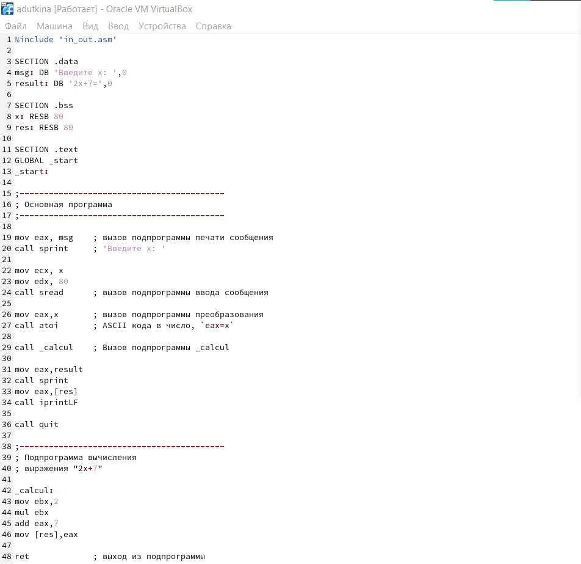{ #fig:001 width=70% }

Первые строки программы отвечают за вывод сообщения на экран (call sprint), чтение данных введенных с клавиатуры (call sread) и преобразования введенных данных из символьного вида в численный (call atoi). После следующей инструкции call _calcul, которая передает управление подпрограмме _calcul, будут выполнены инструкции подпрограммы, написанные до ret. Инструкция ret является последней в подпрограмме и ее исполнение приводит к возвращению в основную программу к инструкции, следующей за инструкцией call, которая вызвала данную подпрограмму. Последние строки программы реализую вывод сообщения (call sprint), результата вычисления (call iprintLF) и завершение программы (call quit).

Создадим исполняемый файл и проверим его работу (рис. [-@fig:002])

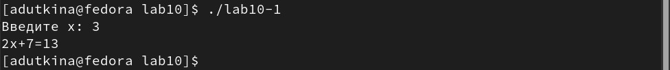{ #fig:002 width=70% }

Изменим текст программы, добавив подпрограмму _subcalcul в подпрограмму _calcul, для вычисления выражения f(g(x)), где x вводится с клавиатуры, f(x) = 2x + 7, g(x) = 3x − 1. Т.е. x передается в подпрограмму _calcul, из нее подпрограмму _subcalcul, где вычисляется выражение g(x), результат возвращается в _calcul и вычисляется выражение f(g(x)). Результат возвращается в основную программу для вывода результата на экран (рис. [-@fig:003]), (рис. [-@fig:004]).

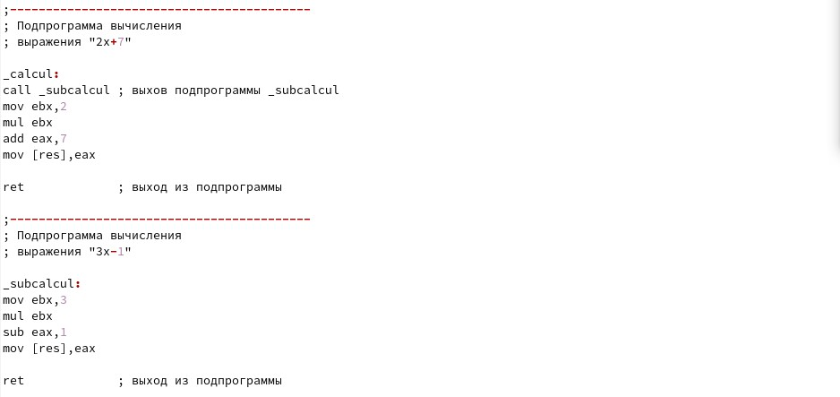{ #fig:003 width=70% }

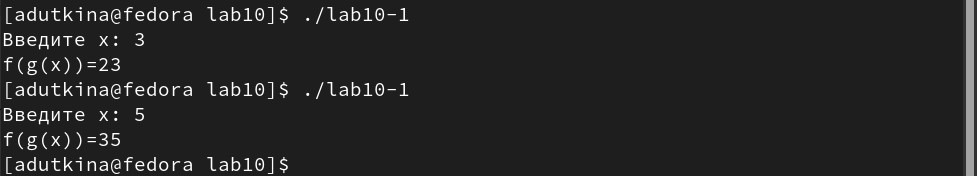{ #fig:004 width=70% }

## Отладка программам с помощью GDB

Создадим файл lab10-2.asm с текстом программы из Листинга 10.2 (рис. [-@fig:005]).

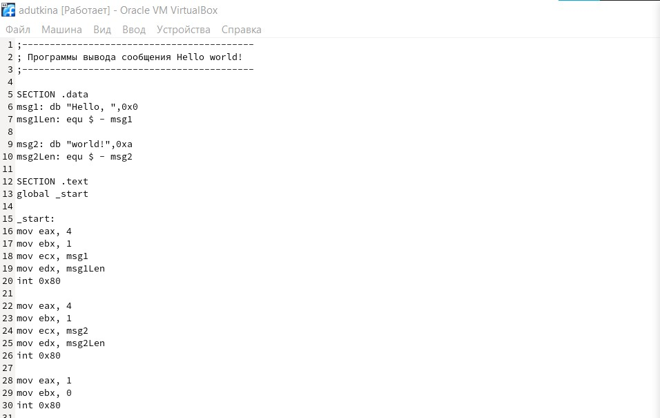{ #fig:005 width=70% }

Получим исполняемый файл. Для работы с GDB в исполняемый файл добавим отладочную информацию, для этого трансляцию программ проводим с ключом ‘-g’, запустим исполняемый файл в отладчик GDB(рис. [-@fig:006])

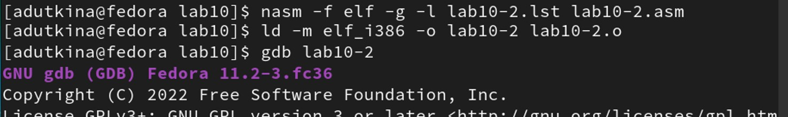{ #fig:006 width=70% }

Проверим работу программы, запустив ее в оболочке GDB с помощью команды run (сокращённо r) (рис. [-@fig:007]).

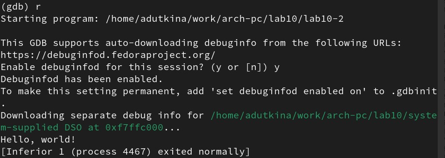{ #fig:007 width=70% }

Для более подробного анализа программы установим брейкпоинт на метку _start, с которой начинается выполнение любой ассемблерной программы, и запустим её. (рис. [-@fig:008])
 
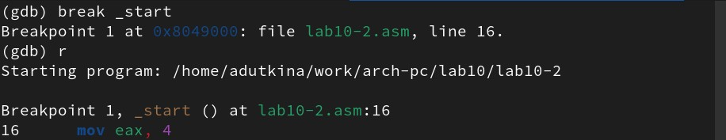{ #fig:008 width=70% }

Посмотрим дисассимилированный код программы с помощью команды disassemble начиная с метки _start (рис. [-@fig:009])

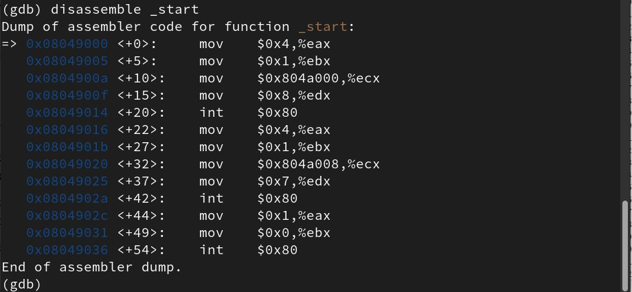{ #fig:009 width=70% }

Переключимся на отображение команд с Intel’овским синтаксисом, введя команду set disassembly-flavor intel (рис. [-@fig:010]).

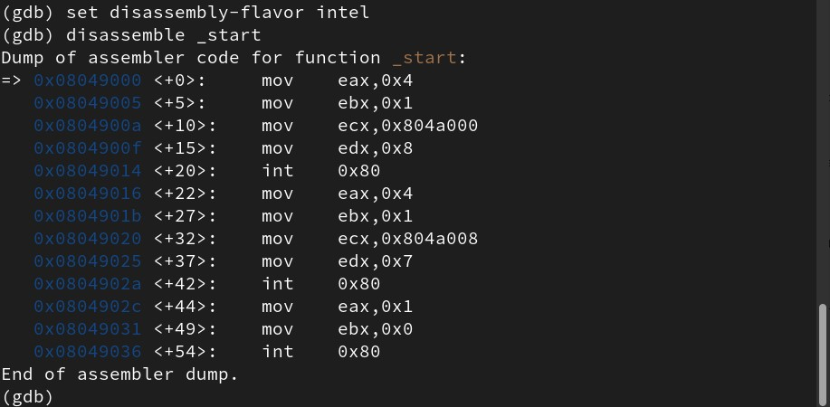{ #fig:010 width=70% }

Различия отображения синтаксиса машинных команд в режимах ATT и Intel в том, что во втором варианте опускается ‘%’ перед именами регистров и инструкции с несколькими операндами перечисляются в разном порядке: Intel в прямом, то есть как записано в программе, а ATT в обратном.

Включим режим псевдографики для более удобного анализа программы (рис. [-@fig:011])

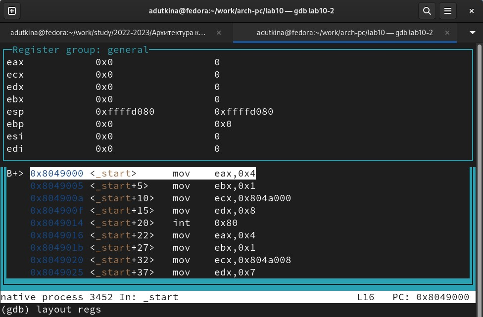{ #fig:011 width=70% }

В этом режиме есть три окна:
- В верхней части видны названия регистров и их текущие значения;
- В средней части виден результат дисассимилирования программы;
- Нижняя часть доступна для ввода команд.

### Добавление точек останова

Установить точку останова можно командой break (кратко b). Типичный аргумент этой команды — место установки. Его можно задать или как номер строки программы (имеет смысл, если есть исходный файл, а программа компилировалась с информацией об отладке), или как имя метки, или как адрес. Чтобы не было путаницы с номерами, перед адресом ставится «звёздочка»: на предыдущих шагах была установлена точка останова по имени метки (_start). Проверим это с помощью команды info breakpoints (кратко i b) (рис. [-@fig:012])

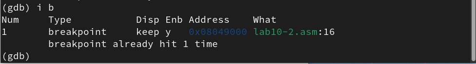{ #fig:012 width=70% }

Установим еще одну точку останова по адресу инструкции. Адрес инструкции можно увидеть в средней части экрана в левом столбце соответствующей инструкции. Установим точку останова для предпоследней инструкции (mov ebx,0x0), определив ее адрес (рис. [-@fig:013])

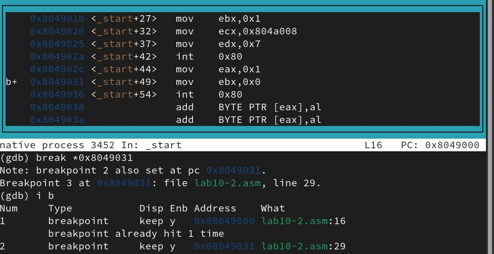{ #fig:013 width=70% }

### Работа с данными программы в GDB

Отладчик может показывать содержимое ячеек памяти и регистров, а при необходимости позволяет вручную изменять значения регистров и переменных. Выполним 5 инструкций с помощью команды stepi (или si). На этих шагах изменяются значения регистров eax, ebx, ecx, edx и еще раз eax. 

Посмотреть содержимое регистров также можно с помощью команды info registers (или i r) (рис. [-@fig:014])

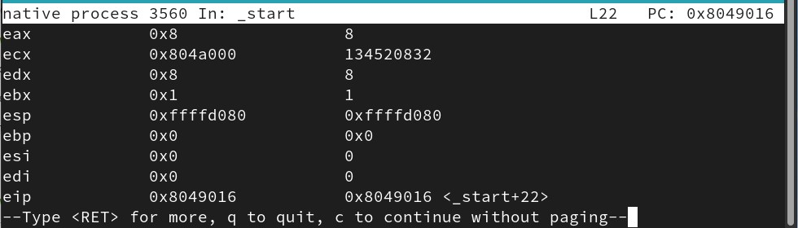{ #fig:014 width=70% }

Для отображения содержимого памяти можно использовать команду x <адрес>, которая выдаёт содержимое ячейки памяти по указанному адресу. Формат, в котором выводятся данные, можно задать после имени команды через косую черту: x/NFU <адрес>. С помощью команды x &<имя переменной> также можно посмотреть содержимое переменной. 

Посмотрим значение переменной msg1 по имени и значение переменной msg2 по адресу (рис. [-@fig:015]). 

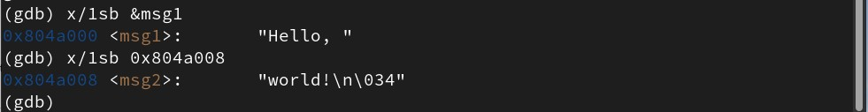{ #fig:015 width=70% }

Изменить значение для регистра или ячейки памяти можно с помощью команды set, задав ей в качестве аргумента имя регистра или адрес. При этом перед именем регистра ставится префикс $, а перед адресом нужно указать в фигурных скобках тип данных (размер сохраняемого значения; в качестве типа данных можно использовать типы языка Си). Изменим первый символ переменной msg1 (рис. [-@fig:016])

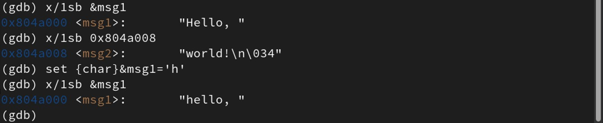{ #fig:016 width=70% }

Заменим второй символ в переменной msg2 на заглавную букву (рис. [-@fig:017]).

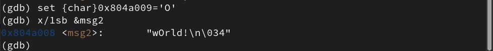{ #fig:017 width=70% }

Чтобы посмотреть значения регистров используется команда print /F <val> (перед именем регистра обязательно ставится префикс $) (рис. [-@fig:018])

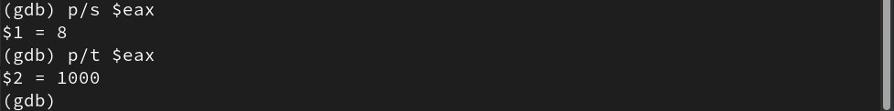{ #fig:018 width=70% }

Выведем в различных форматах (в шестнадцатеричном формате, в двоичном формате и в символьном виде) значение регистра edx. 

С помощью команды set изменим значение регистра ebx (рис. [-@fig:019])

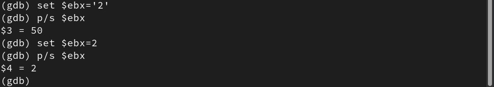{ #fig:019 width=70% }

Завершим выполнение программы с помощью команды continue (сокращенно c) и выйдем из GDB с помощью команды quit (сокращенно q).
 
### Обработка аргументов командной строки в GDB

Скопируем файл lab9-2.asm, созданный при выполнении лабораторной работы №9, с программой выводящей на экран аргументы командной строки в файл с именем lab10-3.asm и создадим исполняемый файл.

Для загрузки в gdb программы с аргументами необходимо использовать ключ --args. Загрузим исполняемый файл в отладчик, указав аргументы 1, 2, 3. 

Как отмечалось в предыдущей лабораторной работе, при запуске программы аргументы командной строки загружаются в стек. Исследуем расположение аргументов командной строки в стеке после запуска программы с помощью gdb.

Для начала установим точку останова перед первой инструкцией в программе и запустим ее (рис. [-@fig:020])

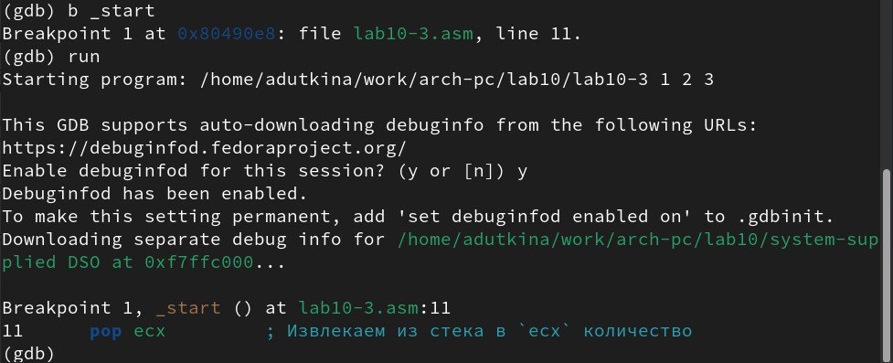{ #fig:020 width=70% }

Адрес вершины стека храниться в регистре esp и по этому адресу располагается число равное количеству аргументов командной строки (включая имя программы). Как видно, число аргументов равно 4 - расположение программы и три аргумента.

Посмотрим остальные позиции стека – по адесу [esp+4] располагается адрес в памяти где находиться имя программы, по адесу [esp+8] храниться адрес первого аргумента, по аресу [esp+12] – второго и т.д. (рис. [-@fig:021])

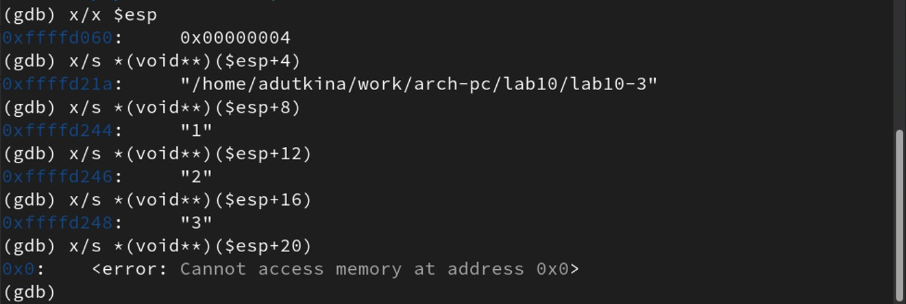{ #fig:021 width=70% }

# Выводы

В ходе лабораторной работы были приобретены навыки написания программ с использованием подпрограмм и изучены методы отладки при помощи GDB и его основные возможности.

