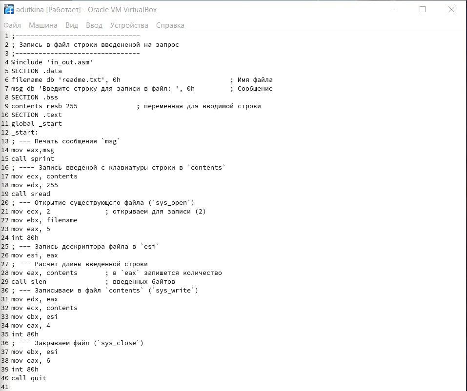
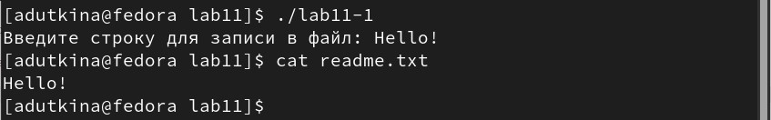
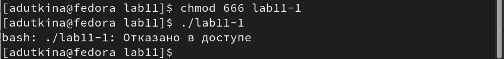
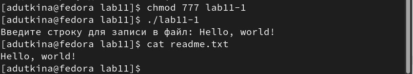
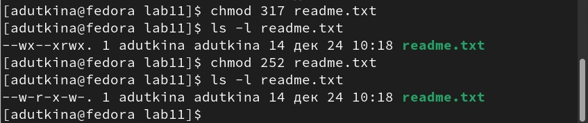
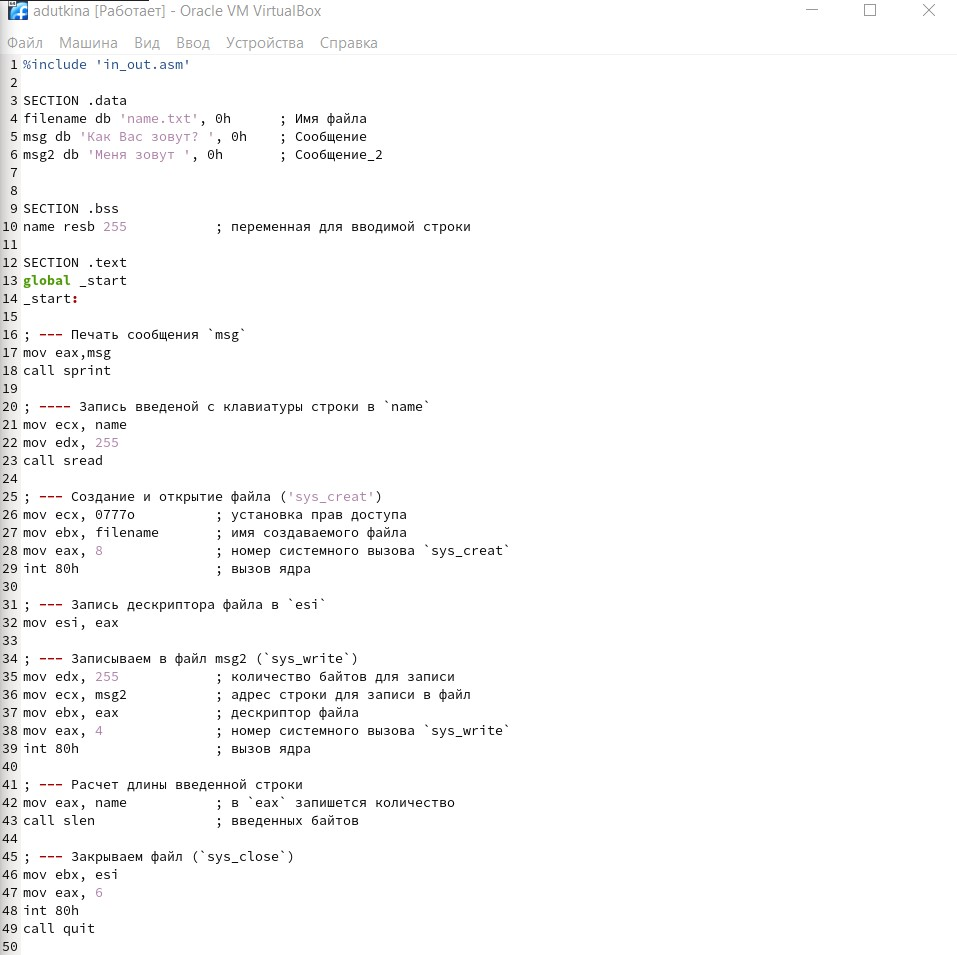
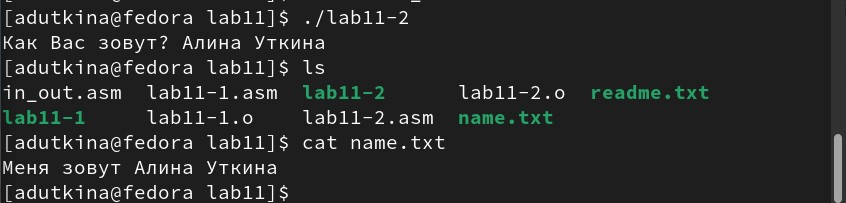

---
## Front matter
title: "Отчёт по лабораторной работе №11"
author: "Уткина Алина Дмитриевна"

## Generic otions
lang: ru-RU
toc-title: "Содержание"

## Bibliography
bibliography: bib/cite.bib
csl: pandoc/csl/gost-r-7-0-5-2008-numeric.csl

## Pdf output format
toc: true # Table of contents
toc-depth: 2
lof: true # List of figures
fontsize: 12pt
linestretch: 1.5
papersize: a4
documentclass: scrreprt
## I18n polyglossia
polyglossia-lang:
  name: russian
  options:
	- spelling=modern
	- babelshorthands=true
polyglossia-otherlangs:
  name: english
## I18n babel
babel-lang: russian
babel-otherlangs: english
## Fonts
mainfont: PT Serif
romanfont: PT Serif
sansfont: PT Sans
monofont: PT Mono
mainfontoptions: Ligatures=TeX
romanfontoptions: Ligatures=TeX
sansfontoptions: Ligatures=TeX,Scale=MatchLowercase
monofontoptions: Scale=MatchLowercase,Scale=0.9
## Biblatex
biblatex: true
biblio-style: "gost-numeric"
biblatexoptions:
  - parentracker=true
  - backend=biber
  - hyperref=auto
  - language=auto
  - autolang=other*
  - citestyle=gost-numeric
## Pandoc-crossref LaTeX customization
figureTitle: "Рис."
tableTitle: "Таблица"
listingTitle: "Листинг"
lofTitle: "Список иллюстраций"
lotTitle: "Список таблиц"
lolTitle: "Листинги"
## Misc options
indent: true
header-includes:
  - \usepackage{indentfirst}
  - \usepackage{float} # keep figures where there are in the text
  - \floatplacement{figure}{H} # keep figures where there are in the text
---

# Цель работы

Целью работы является приобретение навыков написания программ для работы с файлами.

# Выполнение лабораторной работы

Создадим каталог для программам лабораторной работы № 11, перейдем в него и создадим файл lab11-1.asm и readme.txt.

Введем в файл lab11-1.asm текст программы из листинга 11.1 (рис. [-@fig:001]). Создадим исполняемый файл и проверьте его работу (рис. [-@fig:002]).

{ #fig:001 width=70% }

{ #fig:002 width=70% }

С помощью команды chmod изменим права доступа к исполняемому файлу lab11-1, запретив его выполнение. Попытаемся выполнить файл (рис. [-@fig:003]). В команде используется значение "666" - набор прав, расшифровывается как "110 110 110" в двоичной форме записи и "rw- rw- rw-" - в символьной. Таким образом, мы запрещаем исполнение файла, что и сказано при попытке выполнить файл ("отказано в доступе")

{ #fig:003 width=70% }

С помощью команды chmod изменим права доступа к файлу lab11-1.asm с исходным текстом программы, добавив права на исполнение и попытаемся выполнить его (рис. [-@fig:004]). В команде используется значение "777" - набор прав, расшифровывается как "111 111 111" в двоичной форме записи и "rwx rwx rwx" - в символьной. Таким образом, мы добавляем права доступа к исполнению файла, и на попытку выполнить файл нам не выдается ошибка.

{ #fig:004 width=70% }

Предоставим права доступа к файлу readme.txt в соответствии с вариантом 15 в таблице 11.4 и проверим правильность выполнения с помощью команды ls -l (рис. [-@fig:005]). В первом случае нам дана символьная запись "-wx --x rwx", которую переводим в двоичную форму "011 001 111" = "317" в восьмеричной форме. Во втором случае дана запись "010 101 010" в двоичной форме = "252" в восьмеричной. 

{ #fig:005 width=70% }

## Самостоятельная работа

Создадим файл lab11-2.asm для выполнения работы.

Напишем программу работающую по следующему алгоритму (рис. [-@fig:006]):
	- Вывод приглашения “Как Вас зовут?”
	- Ввод с клавиатуры свои фамилию и имя
	- Создание файла с именем name.txt
	- Запись в файл сообщения “Меня зовут”
	- Добавление в файл строки, введенной с клавиатуры
	- Закрытие файла

{ #fig:006 width=70% }

Создадим исполняемый файл и проверим его работу (рис. [-@fig:007]). На экран выводится сообщение об имени и просьба его ввести. Затем видно, что был создан файл name.txt, и при выводе содержимого мы видим ответ с нашим именем.

{ #fig:007 width=70% }

# Выводы

В ходе лабораторной работы были приобретены навыки написания программ для работы с файлами.
